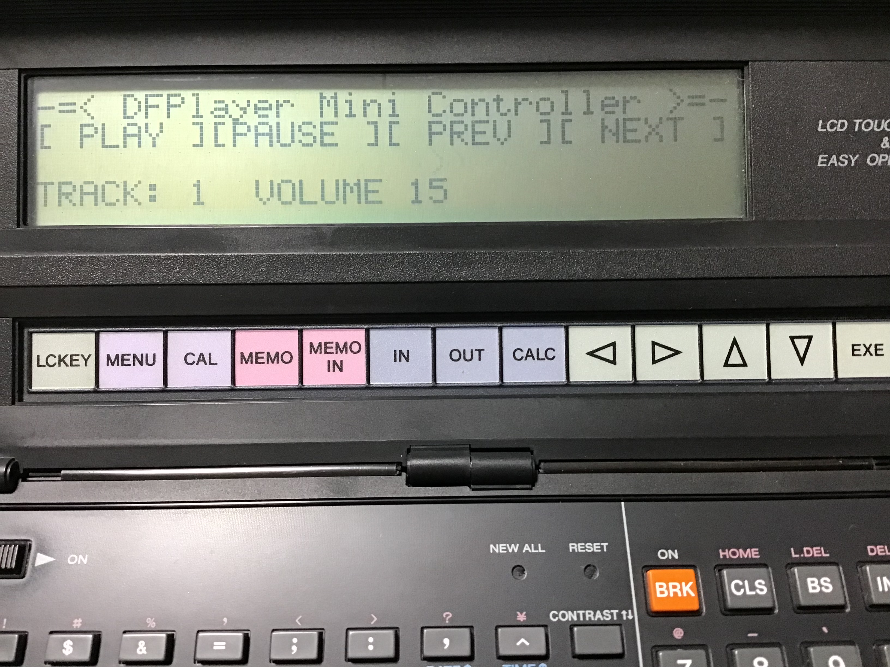
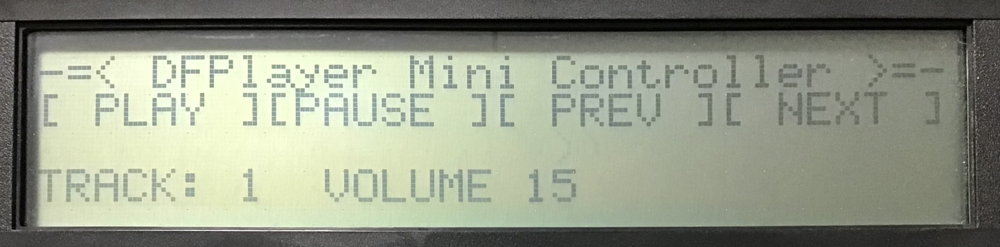

# DFPlayer MiniをPB-1000から制御するサンプル



## 能書き
 
最近、DFPlayer MiniというMP3再生用のモジュールがあるのを知り、年末年始でいじってました。
このモジュール、何が良いかというと、操作コマンドをUARTで行えるので、制御のハードルが比較的低いことがあります。

これを、ポケコンから制御できないか・・・？ということで、ポケコンでの接続を試してみたものです。

## 接続の仕組み
  
PB-1000は単体ではRS-232C(いわゆるUART)通信はできませんが、オプションのFA-7/MD-100を接続するとRS-232C通信ができるようになります。
BASICでもおなじみの`OPEN`,`PRINT#`,`INPUT#`などでRS-232Cへの入出力が可能です。
  
取り急ぎ、クエリーコマンド（DFPlayer Mini側から応答を受け取るコマンド）の制御はちょっと難しそうなので、いったん、コマンド送信オンリーでやってみました。
  
制御コマンドの仕様等については、[こちら](https://github.com/DFRobot/DFRobotDFPlayerMini/tree/master/doc)にあるデータシートPDFを参考にしています。

通常のコマンドは、
   
```
7E,FF,06,[コマンド番号],00,[パラメータ上位],[パラメータ下位],EF
```
  
というフォーマットなので、これを種類に応じてひたすら`PRINT#`文でRS-232Cに出力していきます。

  

## 回路について  

適当なユニバーサル基板をつかって、やっつけで配線してみました。

<div class="separator" style="clear: both;"><a href="https://blogger.googleusercontent.com/img/b/R29vZ2xl/AVvXsEjHaPMj2pu6fUmX1a-UY0-ttBbuveMeUzbjmGM7pIby71XvCy-eP7p5CBTabcNDADdcg3ReRjeS7GNMUbaLttkS8G9703rLYYkzhpNWcX-mDOVeCSv5bTBGS3XOK2nI22TMRna-6-Orh31xj7R6PnE9zjnWW0iYozmoi4Ev9Tt_gpcjesrm5qvtCQwbxur3/s2235/IMG_1678.jpg" style="display: block; padding: 1em 0; text-align: center; "></a></div>
  
- DSub25ピンコネクタは、ジェンダーチェンジャー(オス-オス)しかたまたま手元になかったので、それを使っています。
- 電源はPB-1000/FA-7側から取れるような気もするのですが、とりあえずADM3202とDFPlayerMiniが3.3V駆動なので、1.2Vの単４電池３本で電源共有して駆動しています。
- オペアンプは知識がほとんどゼロなので見様見真似でつけてみました。DFPlayerMiniはDAC出力があって、それをイヤホンに直接繋いでも聴くことは全然できるのですが、やっぱりオペアンプを通したほうが音は良くなるような気がするので、入れてみております。
- 写真ではイヤフォンジャックを左下に配置してしまったのですが、FA-7/MD-100のACアダプタープラグと干渉してしまうので、オペアンプと配置を入れ替えるなどしたほうが良いでしょう。写真ではピンソケットをイヤフォンジャックの下に入れ、持ち上げるようにして無理やり配置しています。
  
### 主な部品

- DSub25ピンコネクタ(オス)
- DCジャックDIP化キット（秋月電子）
- イヤフォンジャックDIP化キット（秋月電子）
- オペアンプ(AD8506)実装モジュール（秋月電子）
- RS232Cレベルコンバータ ADM3202
- DFPlayer Mini互換機

### 接続について

中の人は回路図が書けないので、主要な部品どうしの接続だけ記載しますね。
  
DSub25ピン←→ADM3202

|DSub25ピン|←→|ADM3202|
| ------- | -- | ------ |
|2ピン(TX)|←→|13ピン(R1_IN)|  
|3ピン(RX)|←→|14ピン(T1_OUT)|  

ADM3202←→DFPlayer Mini

|ADM3202|←→|DFPlayer Mini|
| ------- | -- | ------ |
|12ピン(R1_OUT)|←→|2ピン(RX)|  
|11ピン(T1_IN)|←→|3ピン(TX)|  

DFPlayer Mini←→AD8506
  
|DFPlayer Mini|←→|AD8506|
| ------- | -- | ------ |
|4ピン(DAC_R)|←→|5ピン(B+)|  
|5ピン(DAC_L)|←→|3ピン(A+)|  
  
AD8506←→イヤフォンジャック
  
|AD8506|←→|イヤフォン|
| ------- | -- | ------ |
|1ピン(OUTA)|←→|L|  
|7ピン(OUTB)|←→|R|  

AD8506の抵抗器

|接続箇所|抵抗器|
| ------- | ------ |
|A+/B+への入力|510Ω|  
|OUTA〜A-/OUTB〜B-|10kΩ|
|OUTA/OUTBからの出力|1kΩ|
  
その他
- VCC/GNDは電源からよしなに接続してください。  
- ADM3202のコンデンサは1μFのものを使いました。
  
  
## PB-1000の実装

プログラムは `DFPLMINI.BAS` をごらんください。



起動すると自動的に１曲目の演奏を開始します。

操作は以下のとおりです。

| キー操作 | 内容 |
| ------ | --- |
| P または \[PLAY\]タッチ | 再生 |
| スペースキー または \[PAUSE\]タッチ | 一時停止・再開 |
| \( または \[PREV\]タッチ | 前の曲へ |
| \) または \[NEXT\]タッチ | 次の曲へ |
| \+ | ボリュームアップ |
| \- | ボリュームダウン |

## おことわり
  
本記事で使用しているDFPlayer Miniは正規品ではなく互換品のため、プログラムで想定している挙動が、正規品とは異なっている可能性があります。あしからずご了承ください。
ちなみに中の人が入手した互換品は[Amazonで５個セット1,399円のもの](https://amzn.to/47r4oxP)です。

自動でリピート演奏させたかったのですが、互換品ではデータシートどおりに信号を送っても次の曲に移らないので、このサンプルプログラムでは手動でNEXTを選択して次曲を演奏させてください。
